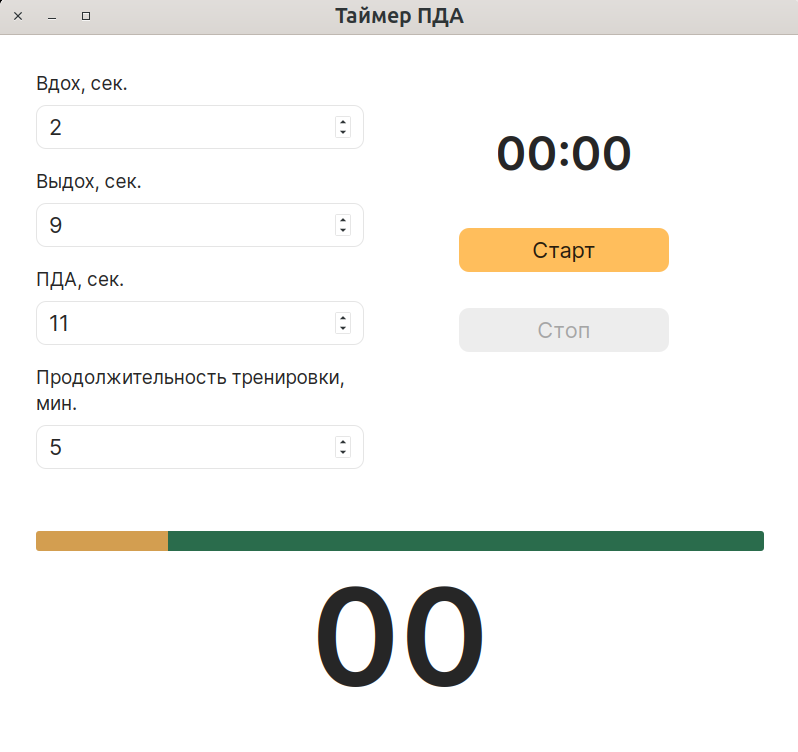

# Таймер ПДА

Таймер Продолжительности Дыхательного Акта (ПДА) для занятий на дыхательном тренажере Фролова.



# О дыхательном тренажере Фролова

- [https://lotos-frolov.ru/vse-o-trenzhere](https://lotos-frolov.ru/vse-o-trenzhere)
- [https://www.breathing.ru/index.html](https://www.breathing.ru/index.html)

# Поддерживаемые операционные системы

- Windows
- Linux
- MacOS

В MacOS после установки приложения нужно в терминале выполнить команду 

```shell
xattr -r -d com.apple.quarantine /Applications/pda-timer.app
```

В противном случае MacOS не даст запустить приложение.
